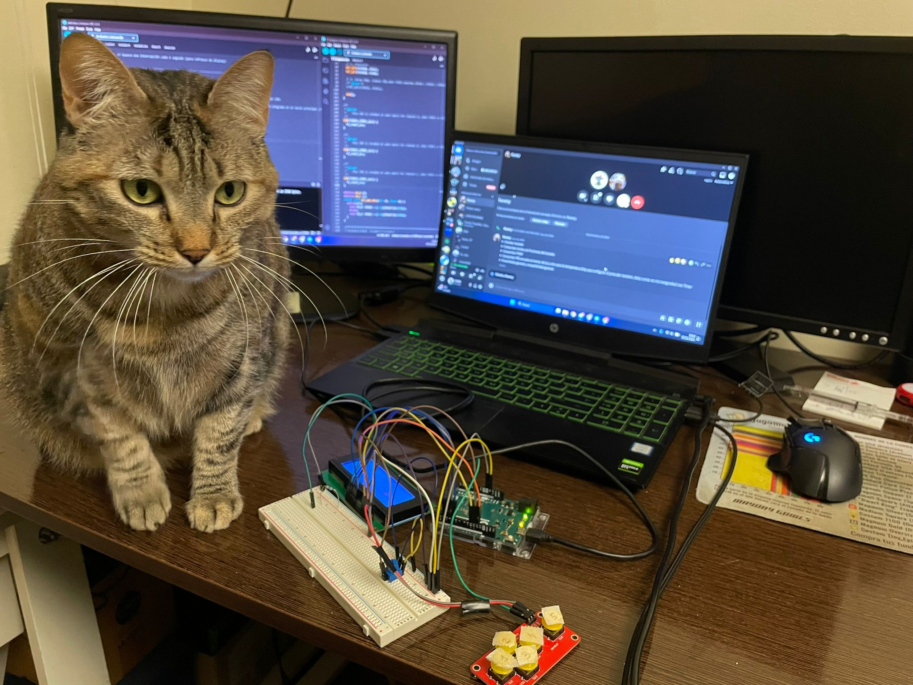

# No Library arduino termostat
This is an optional class proyect where my friend and I built a temperature regulator with arduino hardware without using any librarys, only our own custom made libraries.

## Functionalities:
-Uses a PID filter to adust the temperature smoothly

-Can operate with a discrete digital or a Analog continous dial input

## Characteristics:
-the use of timers, analogic, digital lcd screen is handeled by our own code and uses no arduino libraries 

---
